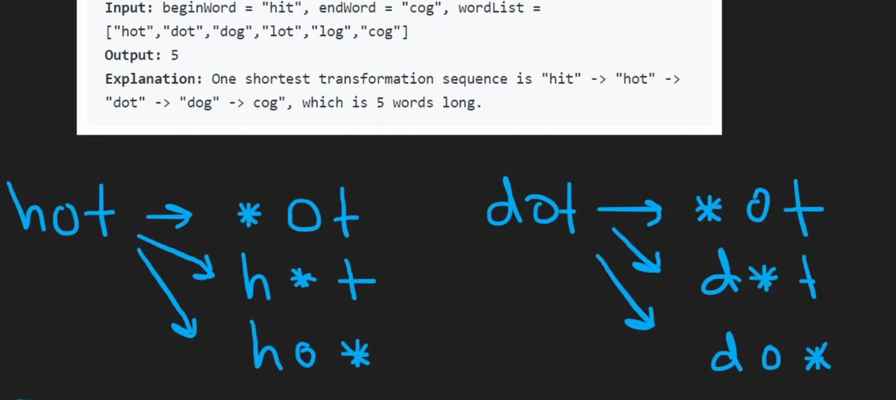

Use BFS to find the shortest path from `beginWord` to `endWord`
Before doing that, we need to build an adjacency list.

The adjacency list is a dictionary in which key is a pattern, and value is a list of word.

For example:
`{'*ot': ['hot', 'dot', 'lot']}`



```python
adjacency_list = collections.defaultdict(list)
for word in wordList:
    for i in range(len(word)):
        pattern = word[0:i] + "*" + word[i + 1:]
        adjacency_list[pattern].append(word)
```