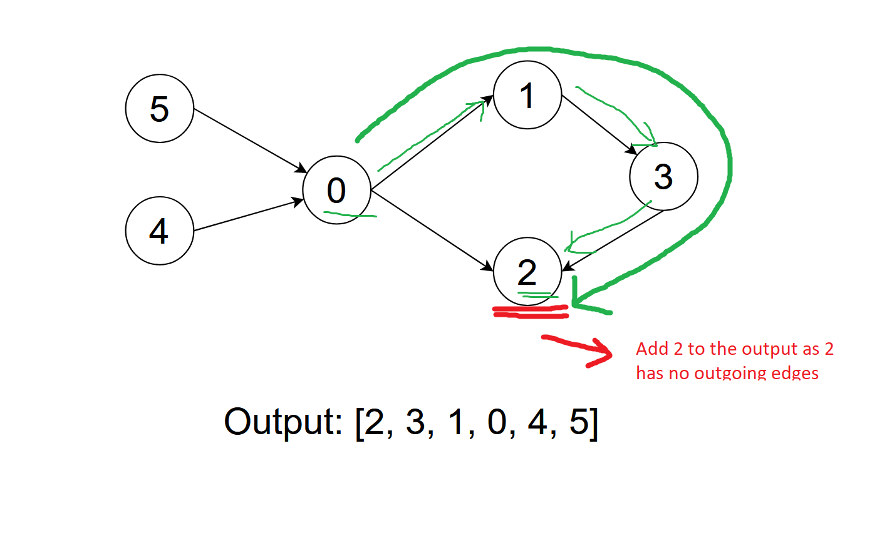

`[0, 1]` means 1 must be taken before 0, aka 1 is prerequisite of 0
Thus we draw `0 -> 1`, `0` depends on `1`
If a node has no prerequisite, it can be added to output
.

We will use DFS for every node to build topological sort order.

```python
def dfs(course) -> bool:
    """Return False if there is a cycle"""
    pass
```

A course has 3 possible states:

    - visited  -> course has been added to ouput
    - visiting -> course not added to output, but currently being visiting
    - unvisited -> course not added to output and not being visiting

We have 2 sets to keep track:

    - visited: visited node so we don't have to visit it again
    - visiting: current path

